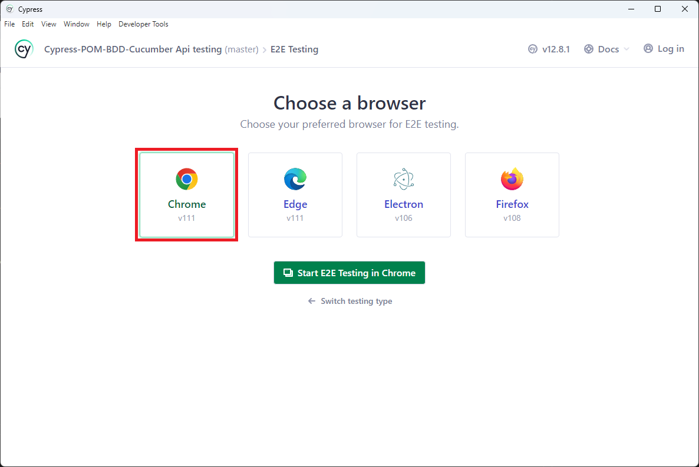
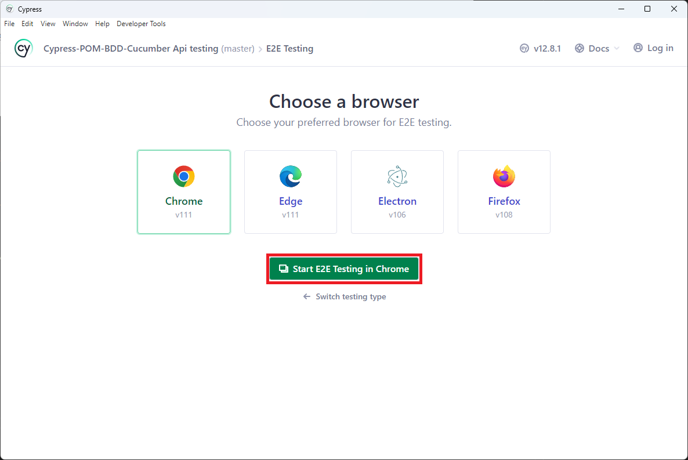
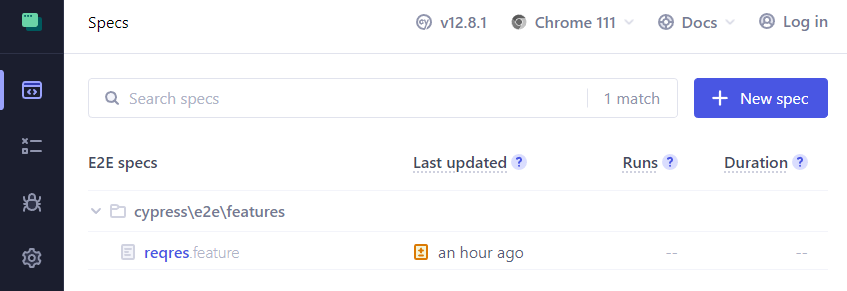
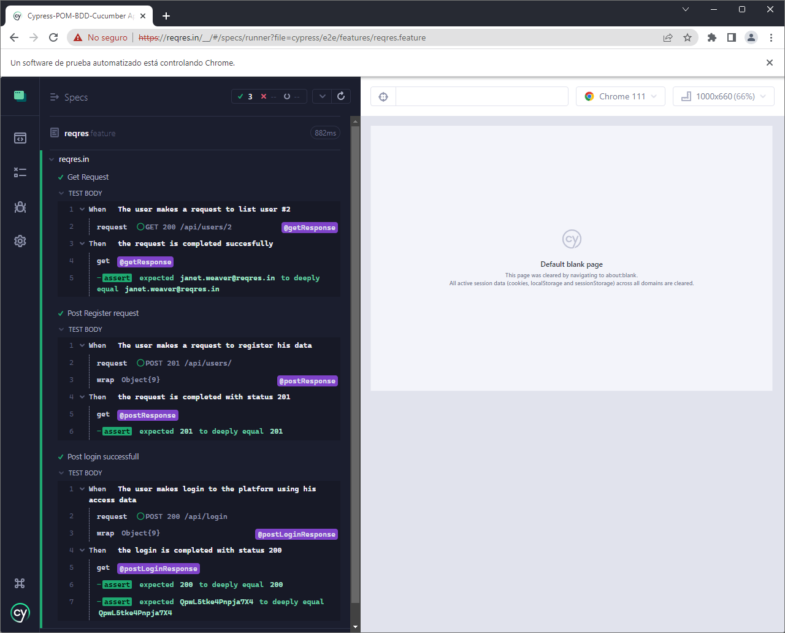

## Testing de API mediante el framework Cypress 
Este repositorio pretende ser una guia basica de trabajo usando Cypress para probar conexiones con API de servidores. Unicamente se ofrece una guia rapida para iniciar a trabajar con Cypress.

## Instalación
1. Debe instalar npm para trabajar de forma optima con este repositorio. Puede instalarlo desde el siguiente link: 
    - Guia de instalacion: https://docs.npmjs.com/downloading-and-installing-node-js-and-npm
    - Descarga de npm (Se recomienda instalar la version LTS mas reciente): https://nodejs.org/en/download

2. Debe instalar git en su equipo para posteriormente descargar el repositorio usando el comando git clone https://github.com/maxdarkx/Cypress-POM-BDD-Cucumber-Api-Testing.git`, o descarguelo como un archivo comprimido:


3. Una vez instalado npm, utilice los siguientes comandos para instalar las dependencias:
    - `npm install cypress --save-dev`
    - `npm install @badeball/cypress-cucumber-preprocessor`
    - `npm install -D @bahmutov/cypress-esbuild-preprocessor`
4. La configuracion del cypress es bastante delicada y critica a la hora de ejecutar las pruebas con cypress. Verifique que el archivo `cypress.config.js` contenga la siguiente funcion requerida para el uso del preprocesador para Cucumber:
```
  async function setupNodeEvents(on, config) {
  // This is required for the preprocessor to be able to generate JSON reports after each run, and more,
  await preprocessor.addCucumberPreprocessorPlugin(on, config);

  on(
    "file:preprocessor",
    createBundler({
      plugins: [createEsbuildPlugin.default(config)],
    })
  );

  // Make sure to return the config object as it might have been modified by the plugin.
  return config;
}
```

5. Utilice el comando `npx cypress open` para abrir Cypress, y ejecute las feature que necesite haciendo clic sobre ellas.
- Se ejecutara la aplicacion Cypress, seleccione la opcion `E2E Testing`.


- Seleccione el navegador de su preferencia (Por ejemplo, google chrome).



- Haga clic en el boton `Start E2E...`



- Se ejecutara la ventana de pruebas de Cypress en el navegador seleccionado. Seleccione la Feature que desea probar



- Se ejecuta tanto la `Feature` seleccionada, como el `StepDefinitions` de dicha feature. Si hace clic sobre los escenarios, se muestran todos los pasos ejecutados por Cypress para la prueba.



6. Tambien puede ejecutar cypress desde la terminal ubicandose en la carpeta de instalacion del proyecto, y usando el comando `npx cypress run`. De este modo se generaran las evidencias (en video y screenshots) para despues ser consumidas por un servicio CI-CD o manualmente, en las carpetas `cypress/video` y `cypress/screenshots`. Consulte la documentacion de cypress para hacer un mejor uso de la consola en https://docs.cypress.io/guides/guides/command-line.